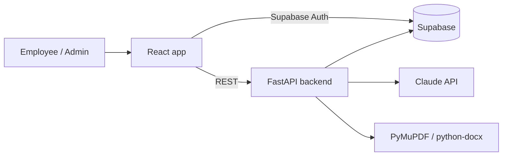

# FIRM FLOW

**AI onboarding for architecture firms that never makes things up.**

FIRM FLOW takes the onboarding material a firm already has and turns it into clear, interactive onboarding. It improves the old manual, checks understanding with one short quiz, and connects new hires to the right person when they have a question.

Built at an AEC hackathon by a team with one architect and four computer science students.

---

## The problem

Onboarding at architecture firms is usually a long static manual, an intranet full of broken links, and a lot of questions to busy senior staff. Nothing separates what you need on Day 1 from what can wait. Firm-specific BIM practices, like how to safely copy a Revit central model or read keynotes, are rarely taught until something breaks.

## Features

### 1. Manual Enhancer (admin)

Upload the firm's existing onboarding manual (PDF or DOCX). The AI acts as an editor, not an author: it splits the manual into modules, rewrites for clarity, and turns procedures into steps and checklists. It **does not add** facts, numbers, or policies.

- Every enhanced passage links back to the original section it came from.
- A grounding check highlights anything not supported by the source.
- Broken links, outdated references, contradictions, and missing steps are **flagged for the admin**, never silently fixed.
- Admins approve each module side by side with the original and tag it Day 1, Week 1, or Later.

### 2. Final Onboarding Check (employee)

One short check at the end of onboarding: 5 to 7 questions, under 5 minutes.

- Questions come only from sections the admin marked critical.
- Mostly realistic scenarios ("You need a copy of the central Revit model to test an option. What do you do?").
- Instant feedback with a link to the exact module section. Retry only what you missed.
- Admins see which questions people fail most.

### 3. Who Do I Ask? Assistant (employee)

A chatbot for questions like:

- "Where is the PTO policy?" → a link to the right module section
- "I had a problem with my payroll, who can I ask?" → a contact card
- "Who is the design manager for Riverside Library?" → a contact card

Contact cards show name, title, email, working hours, and whether the person is in today, with a backup contact if they're out. A **Contact them** button opens a pre-drafted email. People are looked up from the firm's directory through tool calls, so names and emails are never generated. When there's no confident match, the assistant routes to the firm's default contact.

## How the AI stays grounded

| Rule | How it's enforced |
| --- | --- |
| Enhance, never invent | Constrained prompt plus a second grounding-check pass; `module_passages.source_section_id` is required |
| Everything is traceable | Passages link to source sections; quiz questions link to passages |
| Flag, don't fix | Problems go to the `issues` table for the admin |
| Humans approve | Modules and quiz questions start as `draft`; employees only see `approved` |
| Real people only | Contacts come from `people`, `responsibilities`, and `project_roles` rows |

## Tech stack

| Layer | Choice |
| --- | --- |
| Frontend | React + Vite, Tailwind CSS, shadcn/ui, react-diff-viewer |
| Backend | Python, FastAPI |
| Database, auth, storage | Supabase (Postgres) |
| AI | Claude API with tool calling |
| Document parsing | PyMuPDF, python-docx |
| Hosting | Vercel (frontend), Render or Railway (backend) |



## Planned repository structure

The current repo has an early HTML + PyScript prototype (`index.html`, `css/`, `js/`, `py/`). This is the structure we're moving to:

```
firm-flow/
├── frontend/                 # React + Vite app
│   └── src/
│       ├── pages/            # Dashboard, Module, FinalCheck, Assistant, Admin/*
│       ├── components/       # ContactCard, SideBySideReview, ProgressBar, ...
│       └── lib/api.ts        # Calls to the FastAPI backend
├── backend/
│   └── app/
│       ├── main.py
│       ├── routers/          # manuals, modules, quiz, chat, admin
│       ├── services/
│       │   ├── parser.py     # PDF/DOCX → source_sections
│       │   ├── enhancer.py   # source_sections → draft modules + issues
│       │   ├── grounding.py  # checks passages against their source
│       │   ├── quiz.py       # question generation + scenario grading
│       │   └── assistant.py  # chat + directory tools
│       └── db.py
├── supabase/
│   ├── schema.sql            # Tables, enums, views, RLS
│   └── seed.sql              # Demo firm, directory, projects
└── README.md
```

## Getting started

### Prerequisites

- Node.js 20+
- Python 3.11+
- A Supabase project
- An Anthropic API key

### 1. Database

In the Supabase SQL editor, run `supabase/schema.sql`, then `supabase/seed.sql` for the demo firm (Studio Meridian Architects). Create a storage bucket named `manuals` for uploads.

RLS is enabled on every table with no policies, so only the backend (using the service role key) can read and write data. The frontend uses Supabase only for login.

### 2. Backend

```bash
cd backend
python -m venv .venv && source .venv/bin/activate
pip install -r requirements.txt
cp .env.example .env   # fill in the values below
uvicorn app.main:app --reload
```

`.env`:

```
SUPABASE_URL=
SUPABASE_SERVICE_ROLE_KEY=
ANTHROPIC_API_KEY=
ANTHROPIC_MODEL=
FRONTEND_ORIGIN=http://localhost:5173
```

### 3. Frontend

```bash
cd frontend
npm install
cp .env.example .env
npm run dev
```

`.env`:

```
VITE_SUPABASE_URL=
VITE_SUPABASE_ANON_KEY=
VITE_API_URL=http://localhost:8000
```

Never commit `.env` files. The service role key must stay on the backend.

## API overview

| Method | Endpoint | Who | Purpose |
| --- | --- | --- | --- |
| POST | `/api/manuals` | Admin | Upload a manual (multipart `file`, optional `title`); it's parsed into source sections right away |
| GET | `/api/manuals` | Admin | The firm's manuals, newest first |
| GET | `/api/manuals/{id}` | Admin | One manual; poll `status` while processing |
| POST | `/api/manuals/{id}/process` | Admin | Enhance into draft modules, flag issues, run the grounding check. Runs in the background (202); optional body `{"module_topics": [...]}` |
| GET | `/api/manuals/{id}/review` | Admin | Draft modules and passages side by side with source sections |
| GET | `/api/manuals/{id}/issues` | Admin | Flagged problems in reading order; optional `?status=open` |
| PATCH | `/api/modules/{id}` | Admin | Approve, reject, or return to draft; set priority, required, order; edit title and summary (draft only). Approval needs every passage grounded, or `confirm_flagged: true` |
| PATCH | `/api/passages/{id}` | Admin | Edit content, heading, or kind (draft modules only; re-runs the grounding check), or mark critical |
| POST | `/api/quiz/generate` | Admin | Draft 5–7 questions from critical passages in approved modules (replaces drafts; refused once any question is approved) |
| GET | `/api/quiz/questions` | Admin | The question bank with answer keys; optional `?status=` |
| PATCH | `/api/quiz/questions/{id}` | Admin | Edit, approve, or reject a question (approved questions are locked) |
| GET | `/api/admin/progress` | Admin | Per employee: stage, required modules completed, each module's status, final check status and score, last activity |
| GET | `/api/admin/failed-questions` | Admin | Most-failed questions |
| GET | `/api/admin/unanswered` | Admin | Assistant questions that fell back to the default contact, newest first (personal matters show only the topic) |
| GET | `/api/modules` | Employee | Approved modules (Day 1 first) with own progress and whether the final check is unlocked |
| POST | `/api/modules/{id}/progress` | Employee | Start or complete a module (`{"status": "in_progress" \| "completed"}`) |
| POST | `/api/quiz/attempts` | Employee | Start the final check, or resume the one in progress (unlocks after all required modules) |
| GET | `/api/quiz/attempts/current` | Employee | The attempt in progress, or the latest one |
| POST | `/api/quiz/attempts/{id}/answers` | Employee | Answer one question (`selected_choice` or `answer_text`); feedback plus a link to the module section on a miss. Missed questions can be retried |
| POST | `/api/chat` | Employee | Ask the assistant (`{"question": ...}`, up to 500 characters); returns an answer, module links, and contact cards with a pre-drafted `mailto:` |

## Demo walkthrough

1. Admin uploads a messy sample manual and reviews enhanced modules next to the original, with broken links flagged.
2. Admin approves a module and marks it Day 1 and critical.
3. Intern logs in, sees their progress, and completes a module.
4. Intern asks, "I had a problem with my payroll, who can help?" The payroll manager is out, so the card shows the backup.
5. Intern takes the final check, misses the Revit scenario, and gets a link back to the BIM module.
6. Admin sees progress and the most-failed question.

## Roadmap

- ADP / Paycor and live calendar integration
- Slack and intranet ingestion
- Mentor/mentee matching
- A Revit plugin that surfaces firm guidance inside Revit
- Multi-firm accounts and embeddings search for large firms

## Team

- **Jerry** — PM, Architecture
- **Musa** — CS
- **Jero** — CS
- **Logan** — CS
- **Sokol** — CS

GitHub: [@Scopexx0](https://github.com/Scopexx0), [@Smemedi](https://github.com/Smemedi), [@glopez1gerardo1-ops](https://github.com/glopez1gerardo1-ops), [@loganrsilvers](https://github.com/loganrsilvers), [@musawaghu](https://github.com/musawaghu)
