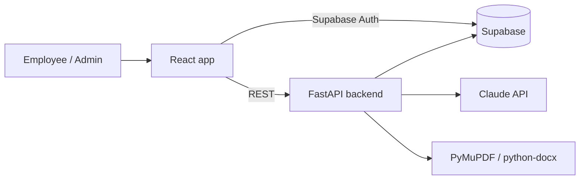

# FIRM FLOW

**AI onboarding for architecture firms that never makes things up.**

FIRM FLOW takes the onboarding material a firm already has and turns it into clear, interactive onboarding. It improves the old manual, checks understanding with one short quiz, and connects new hires to the right person when they have a question.

Built at an AEC hackathon by a team with one architect and four computer science students.

---

## The problem

Onboarding at architecture firms is usually a long static manual, an intranet full of broken links, and a lot of questions to busy senior staff. Nothing separates what you need on Day 1 from what can wait. Firm-specific BIM practices, like how to safely copy a Revit central model or read keynotes, are rarely taught until something breaks.

## Two layers of content

Every firm's onboarding is built from two layers:

- **AEC baseline, shared by every firm:** general practice such as Revit worksharing basics, central vs. local models, BIM Execution Plans, file naming conventions, drawing set organization, and consultant coordination, plus a "Getting Started at an AEC Firm" module drawn from our architect's own first weeks. The baseline is a guide written once and reviewed by a licensed architect (`samples/aec_baseline_guide.pdf`). It goes through the same enhancer and grounding check as a firm manual, so baseline passages are traceable too.
- **Firm overlay:** each firm's own manual (templates, standards, policies), project directory, and people. A firm admin chooses which baseline modules its employees see, their priority and order, and which baseline passages are critical for the final check.

**Where they conflict, the firm wins.** When a firm manual is processed, the AI compares it with the baseline and proposes overrides, quoting both passages ("Our firm names sheets like A-101, not A1.01"). Once the admin confirms an override, employees see the firm's rule in place of the baseline one, with a note: "Studio Meridian Architects does this differently." The final check and the assistant use the firm's version too.

## Features

### 1. Manual Enhancer (admin)

Upload the firm's existing onboarding manual (PDF or DOCX). The AI acts as an editor, not an author: it splits the manual into modules, rewrites for clarity, and turns procedures into steps and checklists. It **does not add** facts, numbers, or policies.

- Every enhanced passage links back to the original section it came from.
- A grounding check highlights anything not supported by the source.
- Broken links, outdated references, contradictions, and missing steps are **flagged for the admin**, never silently fixed.
- Admins approve each module side by side with the original and tag it Day 1, Week 1, or Later.

### 2. Final Onboarding Check (employee)

One short check at the end of onboarding: 5 to 7 questions, under 5 minutes.

- Questions come only from sections the admin marked critical.
- Mostly realistic scenarios ("You need a copy of the central Revit model to test an option. What do you do?").
- Instant feedback with a link to the exact module section. Retry only what you missed.
- Admins see which questions people fail most.

### 3. Who Do I Ask? Assistant (employee)

A chatbot for questions like:

- "Where is the PTO policy?" → a link to the right module section
- "I had a problem with my payroll, who can I ask?" → a contact card
- "Who is the design manager for Riverside Library?" → a contact card

Contact cards show name, title, email, working hours, and whether the person is in today, with a backup contact if they're out. A **Contact them** button opens a pre-drafted email. People are looked up from the firm's directory through tool calls, so names and emails are never generated. When there's no confident match, the assistant routes to the firm's default contact.

## How the AI stays grounded

| Rule | How it's enforced |
| --- | --- |
| Enhance, never invent | Constrained prompt plus a second grounding-check pass; `module_passages.source_section_id` is required |
| Everything is traceable | Passages link to source sections; quiz questions link to passages |
| Flag, don't fix | Problems go to the `issues` table for the admin |
| Humans approve | Modules and quiz questions start as `draft`; employees only see `approved` |
| Real people only | Contacts come from `people`, `responsibilities`, and `project_roles` rows |
| Firm wins, visibly | Baseline overrides quote both passages verbatim and need admin confirmation; the note employees see is fixed text |

## Tech stack

| Layer | Choice |
| --- | --- |
| Frontend | React + TypeScript + Vite, Tailwind CSS, shadcn/ui, react-diff-viewer |
| Backend | Python, FastAPI |
| Database, auth, storage | Supabase (Postgres) |
| AI | Claude API with tool calling |
| Document parsing | PyMuPDF, python-docx |
| Hosting | Vercel (frontend), Render or Railway (backend) |



## Repository structure

`website-base/` is the team's earlier Next.js prototype with mock data.

```
firm-flow/
├── frontend/                 # React + TypeScript + Vite app (styled by Design.md)
│   └── src/
│       ├── pages/            # Landing, employee/* (home, module), admin/* (dashboard, module editor)
│       ├── components/       # TopNav, LoginModal, Meter, BarList, PassageText, ...
│       ├── lib/api.ts        # Typed calls to the FastAPI backend
│       ├── lib/auth.tsx      # Supabase sign-in, role check via /api/me
│       └── styles/tokens.css # The :root tokens, copied verbatim from Design.md
├── backend/
│   └── app/
│       ├── main.py
│       ├── routers/          # account, manuals, modules, quiz, chat, admin, baseline
│       ├── services/
│       │   ├── parser.py     # PDF/DOCX → source_sections
│       │   ├── enhancer.py   # source_sections → draft modules + issues
│       │   ├── grounding.py  # checks passages against their source
│       │   ├── overrides.py  # finds firm rules that replace baseline passages
│       │   ├── content.py    # what a firm's employees see (firm + baseline)
│       │   ├── quiz.py       # question generation + scenario grading
│       │   └── assistant.py  # chat + directory tools
│       └── db.py
├── supabase/
│   ├── schema.sql            # Tables, enums, views, RLS
│   └── seed.sql              # Demo firm, directory, projects
├── Design.md                 # Design system: colors, type, borders, layout
└── README.md
```

## Getting started

### Prerequisites

- Node.js 20+
- Python 3.11+
- A Supabase project
- An Anthropic API key

### 1. Database

In the Supabase SQL editor, run `supabase/schema.sql`, then `supabase/seed.sql` for the demo firm (Studio Meridian Architects). Create a storage bucket named `manuals` for uploads.

A database created before the baseline layer existed needs `supabase/migrations/002_baseline_overlay.sql` once.

Then load the AEC baseline (calls Claude). Review the printout with a licensed architect before approving it:

```bash
cd backend
.venv/bin/python -m scripts.load_baseline            # upload and process; prints the modules for review
.venv/bin/python -m scripts.load_baseline --approve  # publish the baseline to every firm
```

RLS is enabled on every table with no policies, so only the backend (using the service role key) can read and write data. The frontend uses Supabase only for login.

### 2. Backend

```bash
cd backend
python -m venv .venv && source .venv/bin/activate
pip install -r requirements.txt
cp .env.example .env   # fill in the values below
uvicorn app.main:app --reload
```

`.env`:

```
SUPABASE_URL=
SUPABASE_SERVICE_ROLE_KEY=
SUPABASE_ANON_KEY=    # only for scripts/get_token.py (logging in as a demo user)
ANTHROPIC_API_KEY=
ANTHROPIC_MODEL=
FRONTEND_ORIGIN=http://localhost:5173   # comma-separate several origins
DEMO_DATE=            # optional, YYYY-MM-DD: pins "today" for who's-in-today on contact cards
ENVIRONMENT=development   # "production" turns off /docs and turns on HSTS
```

In production, run uvicorn behind HTTPS with `--proxy-headers` so rate limits see the real client address. The Docker image does this.

### Deploy the backend (Cloud Run)

`backend/Dockerfile` builds the production image. Cloud Build builds it from source, so you don't need Docker locally. One-time setup:

```bash
gcloud auth login
gcloud config set project <PROJECT_ID>
gcloud services enable run.googleapis.com cloudbuild.googleapis.com artifactregistry.googleapis.com secretmanager.googleapis.com

# The two secrets go in Secret Manager, never in env vars or the image.
printf %s "$SUPABASE_SERVICE_ROLE_KEY" | gcloud secrets create SUPABASE_SERVICE_ROLE_KEY --data-file=-
printf %s "$ANTHROPIC_API_KEY" | gcloud secrets create ANTHROPIC_API_KEY --data-file=-
# Let the Cloud Run runtime service account read them:
gcloud projects add-iam-policy-binding <PROJECT_ID> \
  --member="serviceAccount:<PROJECT_NUMBER>-compute@developer.gserviceaccount.com" \
  --role=roles/secretmanager.secretAccessor
```

Deploy (run it again to redeploy):

```bash
gcloud run deploy firmflow-api --source backend --region us-central1 \
  --allow-unauthenticated \
  --no-cpu-throttling --min-instances=1 --max-instances=1 \
  --timeout=900 --memory=1Gi --cpu=1 \
  --set-env-vars="^|^ENVIRONMENT=production|SUPABASE_URL=<url>|ANTHROPIC_MODEL=claude-opus-5|FRONTEND_ORIGIN=https://firmflow-iota.vercel.app,http://localhost:5173|DEMO_DATE=2026-09-28" \
  --set-secrets=SUPABASE_SERVICE_ROLE_KEY=SUPABASE_SERVICE_ROLE_KEY:latest,ANTHROPIC_API_KEY=ANTHROPIC_API_KEY:latest
```

Why these flags:

| Flag | Why |
| --- | --- |
| `--no-cpu-throttling`, `--min-instances=1` | Manual processing runs as a background task after the response returns (up to about 15 minutes). CPU must stay on and the instance must stay up. |
| `--max-instances=1` | Rate limits are kept in memory, so they're only correct with one instance. |
| `--timeout=900` | Quiz generation holds its request open for up to 5 minutes. |
| `--allow-unauthenticated` | The API checks Supabase logins itself. Cloud Run's own gate would block browsers. |

`FRONTEND_ORIGIN` takes a comma list. Once the frontend is deployed, add its URL. That's why the command uses `^|^` as the separator. After the demo, `--min-instances=0` lets the service scale to zero.

### 3. Frontend

```bash
cd frontend
npm install
cp .env.example .env
npm run dev
```

`.env`:

```
VITE_SUPABASE_URL=
VITE_SUPABASE_ANON_KEY=
VITE_API_URL=http://localhost:8000
```

`VITE_SUPABASE_ANON_KEY` is the public anon key (the backend's `SUPABASE_ANON_KEY`); row level security stops it from reading any table. `VITE_API_URL` can point at the deployed backend instead. The dev server runs on port 5173, which the backend's default `FRONTEND_ORIGIN` allows.

What's in the app:

- **Landing page** (`/`): the problem, how FIRM FLOW solves it, and how it works. **Log in** (top right) asks whether you're an admin or an employee, and refuses an account of the other kind.
- **Employee** (`/app`): modules in the left sidebar grouped by Day 1, Week 1, and First month; a home page with a progress chart, what's up next, and the onboarding checklist; module pages with the firm's notes where it overrides the AEC baseline. Opening a module starts it; **Mark as complete** finishes it.
- **Admin** (`/admin`): who has finished onboarding, each new hire's progress and final check, and the sections new hires miss most on the final check. The left sidebar lists the firm's modules and the AEC baseline modules: set when each is due, whether it's required, whether baseline modules are shown, and which passages are critical for the final check. The firm's own module text can be edited (it goes back to draft and is re-checked against the manual).

Never commit `.env` files. The service role key must stay on the backend.

### Deploy the frontend (Vercel)

Live at https://firmflow-iota.vercel.app (Vercel project `firmflow`). `frontend/vercel.json` sends every path to `index.html`, so links like `/app/final-check` work on refresh. The project's production environment variables are `VITE_SUPABASE_URL`, `VITE_SUPABASE_ANON_KEY` (added as `--type config`: it's public by design), and `VITE_API_URL` (the Cloud Run URL). Vite bakes them in at build time, so redeploy after changing one.

The project is connected to this GitHub repo with root directory `frontend`: a push to `master` deploys to production, and every pull request gets a preview build. To deploy by hand instead, run `vercel deploy --prod` from the repo root (the root directory setting points it at `frontend/`).

The backend only answers browsers from origins in `FRONTEND_ORIGIN`. If the frontend's URL changes, add it there and redeploy the backend.

## Security and limits

- **Access:** every endpoint except `/api/health` needs a Supabase login, and admin endpoints need an admin profile. Every query is scoped to the caller's firm. A test (`backend/tests/test_security.py`) pins the access level of every route, so a new route can't ship unprotected by accident.
- **Data:** Supabase row level security is on for every table with no policies, so the public anon key can't read anything; only the backend (service role key) can. The `manuals` storage bucket is private.
- **Rate limits** (`backend/app/ratelimit.py`), answered with `429` and `Retry-After`:

  | What | Limit |
  | --- | --- |
  | Any `/api` request | 300 per minute per IP |
  | Assistant questions | 10 per minute and 200 per day per person |
  | Final check answers (scenario answers are graded by Claude) | 20 per minute per person |
  | Passage edits (re-run the grounding check) | 60 per hour per firm |
  | Manual uploads | 20 per hour per firm |
  | Processing a manual, detecting baseline overrides, generating the quiz | 10 per hour per firm each |

  Limits are kept in memory, so they apply per backend process; several instances would need a shared store such as Redis.
- **Claude calls are bounded:** a call gives up if the connection goes silent for 3 minutes, retries once, and has a wall-clock deadline (15 minutes to process a manual, 5 for grounding, overrides, and quiz generation, 90 seconds to grade an answer). The assistant has 60 seconds per question and falls back to the firm's default contact.
- **Uploads:** PDF or DOCX only (checked by content, not just extension), 25 MB and 200 pages at most; DOCX files that unpack to more than 200 MB are refused.
- **Responses:** `nosniff`, `X-Frame-Options: DENY`, `Cache-Control: no-store` and a locked-down CSP on API responses; CORS allows only `FRONTEND_ORIGIN`, without cookies.
- **Prompt injection:** manual text and employee answers are passed to Claude as data inside tags. Enhanced text must pass the grounding check and admin review, contact cards come from directory rows, and the assistant's tools are read-only.

## API overview

| Method | Endpoint | Who | Purpose |
| --- | --- | --- | --- |
| GET | `/api/me` | Anyone signed in | The caller's name, role (`admin` or `employee`), and firm; the frontend uses it to open the right view |
| POST | `/api/manuals` | Admin | Upload a manual (multipart `file`, optional `title`); it's parsed into source sections right away |
| GET | `/api/manuals` | Admin | The firm's manuals, newest first |
| GET | `/api/manuals/{id}` | Admin | One manual; poll `status` while processing |
| POST | `/api/manuals/{id}/process` | Admin | Enhance into draft modules, flag issues, run the grounding check. Runs in the background (202); optional body `{"module_topics": [...]}` |
| GET | `/api/manuals/{id}/review` | Admin | Draft modules and passages side by side with source sections |
| GET | `/api/manuals/{id}/issues` | Admin | Flagged problems in reading order; optional `?status=open` |
| PATCH | `/api/modules/{id}` | Admin | Approve, reject, or return to draft; set priority, required, order; edit title and summary (draft only). Approval needs every passage grounded, or `confirm_flagged: true` |
| PATCH | `/api/passages/{id}` | Admin | Edit content, heading, or kind (draft modules only; re-runs the grounding check), or mark critical. On a baseline passage, only `is_critical` (for this firm) |
| POST | `/api/quiz/generate` | Admin | Draft 5–7 questions from critical passages in approved modules (replaces drafts; refused once any question is approved) |
| GET | `/api/quiz/questions` | Admin | The question bank with answer keys; optional `?status=` |
| PATCH | `/api/quiz/questions/{id}` | Admin | Edit, approve, or reject a question (approved questions are locked) |
| GET | `/api/admin/progress` | Admin | Per employee: stage, required modules completed, each module's status, final check status and score, last activity |
| GET | `/api/admin/failed-questions` | Admin | Most-failed questions |
| GET | `/api/admin/unanswered` | Admin | Assistant questions that fell back to the default contact, newest first (personal matters show only the topic) |
| GET | `/api/baseline/modules` | Admin | The shared AEC baseline modules with this firm's settings (including hidden ones) |
| PATCH | `/api/baseline/modules/{id}` | Admin | This firm's priority, required flag, order, or visibility for a baseline module |
| GET | `/api/manuals/{id}/overrides` | Admin | Where this manual states a different practice than the baseline; optional `?status=` |
| POST | `/api/manuals/{id}/overrides/detect` | Admin | Compare the manual with the baseline again (runs automatically when a manual is processed) |
| PATCH | `/api/overrides/{id}` | Admin | Confirm (employees see the firm's version) or dismiss an override |
| GET | `/api/modules` | Employee | Approved firm and baseline modules (Day 1 first) with own progress and whether the final check is unlocked; overridden baseline passages show the firm's version and a note |
| POST | `/api/modules/{id}/progress` | Employee | Start or complete a module (`{"status": "in_progress" \| "completed"}`) |
| POST | `/api/quiz/attempts` | Employee | Start the final check, or resume the one in progress (unlocks after all required modules) |
| GET | `/api/quiz/attempts/current` | Employee | The attempt in progress, or the latest one |
| POST | `/api/quiz/attempts/{id}/answers` | Employee | Answer one question (`selected_choice` or `answer_text`); feedback plus a link to the module section on a miss. Missed questions can be retried |
| POST | `/api/chat` | Employee | Ask the assistant (`{"question": ...}`, up to 500 characters); returns an answer, module links, and contact cards with a pre-drafted `mailto:` |

## Demo walkthrough

1. Admin uploads a messy sample manual and reviews enhanced modules next to the original, with broken links flagged.
2. Admin approves a module and marks it Day 1 and critical, and confirms the proposed baseline override: Studio Meridian numbers sheets A-101, the baseline A1.01.
3. Intern logs in and sees their progress: the firm's modules, then the shared AEC baseline. In Drawing Set Organization, the sheet-number rule is the firm's, marked "Studio Meridian Architects does this differently." They complete a module.
4. Intern asks, "I had a problem with my payroll, who can help?" The payroll manager is out, so the card shows the backup.
5. Intern takes the final check, misses the Revit scenario, and gets a link back to the BIM module.
6. Admin sees progress and the most-failed question.

Before the demo, set `DEMO_DATE=2026-09-28` in `backend/.env` (a Monday: the payroll manager is out, his backup is in) and restart the backend. To run the intern's part again, reset their progress, final check, and assistant history:

```bash
cd backend
.venv/bin/python -m scripts.reset_demo   # Alex Rivera by default
```


## Team

- **Jerry** — PM, Architecture
- **Musa** — CS
- **Jero** — CS
- **Logan** — CS
- **Sokol** — CS

GitHub: [@Scopexx0](https://github.com/Scopexx0), [@Smemedi](https://github.com/Smemedi), [@glopez1gerardo1-ops](https://github.com/glopez1gerardo1-ops), [@loganrsilvers](https://github.com/loganrsilvers), [@musawaghu](https://github.com/musawaghu)
